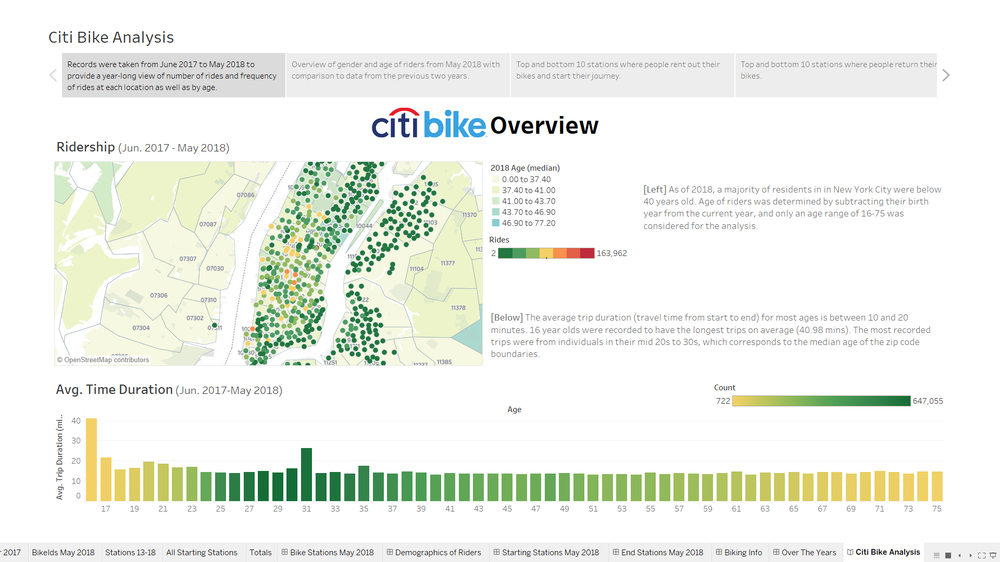

# NYC Citi Bikes
Using the [Citi Bike Data](https://www.citibikenyc.com/system-data), I selected data ranging from the last year (June 2017 to May 2018) as well as used yearly June data from 2013 to 2018 to create an overview of trends in location popularity, age and gender of riders, and time and seasonal usage. June 2017 to May 2018 data was complied in `bike_stations.ipynb` and saved as CSVs. 

A completed analysis was created on Tableau and can be viewed at https://public.tableau.com/profile/victoria.lam22#!/vizhome/CityBikeAnalysis/CitiBikeAnalysis.

